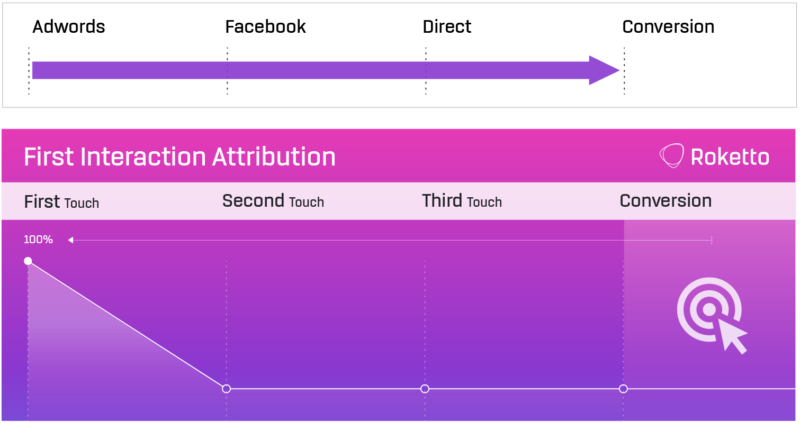
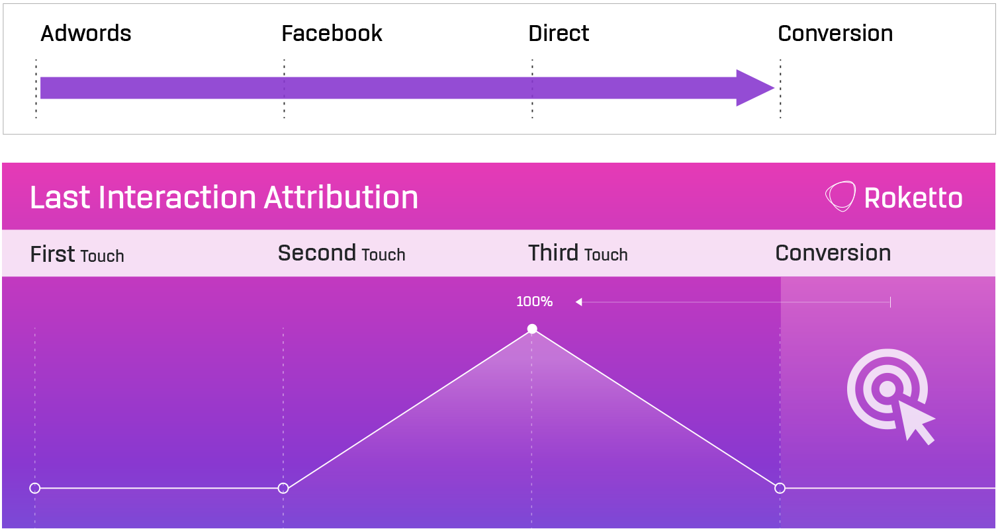
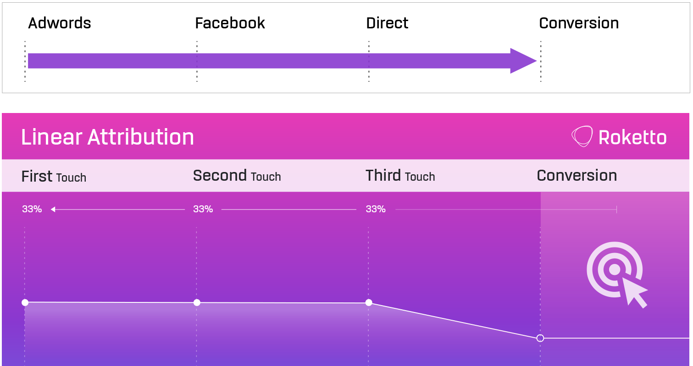
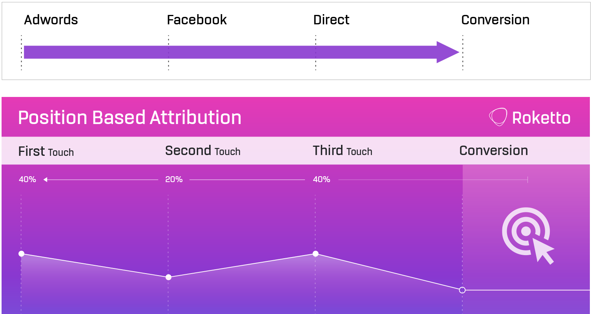

# Multi-Touch Attribution Analytics

[](https://github.com/Vignesh-Hariharan/multi-touch-attribution/actions/workflows/ci.yml)
[](LICENSE)
[](https://www.python.org/)
[](https://www.snowflake.com/)
[](https://www.getdbt.com/)
[](https://public.tableau.com/views/Multi-TouchAttributionAnalysis/Multi-TouchAttributionAnalysis?:language=en-US&:sid=&:redirect=auth&:display_count=n&:origin=viz_share_link)

Scores the same purchases under four attribution models (first-touch, last-touch,
linear, position-based) to show how much the choice of rule moves credit between
paid media and site channels. Python generates GA4-style events and programmatic
ad impressions, loads them into Snowflake, and dbt builds and tests the marts that
feed a Tableau Public dashboard.

[View the dashboard on Tableau Public](https://public.tableau.com/views/Multi-TouchAttributionAnalysis/Multi-TouchAttributionAnalysis?:language=en-US&:sid=&:redirect=auth&:display_count=n&:origin=viz_share_link)

## What the run shows

277 purchases, $38,491.99 revenue, seed 42. 162 of those purchases (58%) had at
least one viewable paid impression in the 30 days before checkout. How much of the
revenue paid media gets depends entirely on the model:

| Model | Paid media | Site visits | Paid share |
|-------|-----------:|------------:|-----------:|
| Last-touch | $0 | $38,492 | 0% |
| Position-based (40/40/20) | $11,600 | $26,892 | 30% |
| Linear | $13,691 | $24,801 | 36% |
| First-touch | $20,603 | $17,889 | 54% |

Last-touch gives paid media nothing because a purchase always happens inside a
site session, and that session's `session_start` is always the last touch before
checkout. Impressions are view-through: they come before the visit, never between
the session start and the purchase. That's the structural blind spot of last-touch
reporting, and it holds here by construction.

Position-based vs last-touch by channel:

| Channel | Last-touch | Position-based | Difference |
|---------|-----------:|---------------:|-----------:|
| direct | $14,745 | $10,177 | -$4,568 |
| google_organic | $11,081 | $7,609 | -$3,472 |
| social_facebook | $5,819 | $5,035 | -$784 |
| prospecting_video | $0 | $4,118 | +$4,118 |
| prospecting_display | $0 | $3,182 | +$3,182 |
| prospecting_native | $0 | $3,107 | +$3,107 |
| referral | $4,744 | $2,697 | -$2,047 |
| email | $2,103 | $1,374 | -$728 |
| retargeting_display | $0 | $516 | +$516 |
| retargeting_video | $0 | $356 | +$356 |
| retargeting_native | $0 | $321 | +$321 |

Retargeting stays small under every model. It only serves between a user's first
visit and first purchase, so it's rarely first and never last, and position-based
gives middle touches 20% between them.

### What this doesn't show

The data is synthetic, and in the generator ads have no effect on whether
someone buys: purchase probability is the same with or without exposure. All
four models still hand paid media credit, between $0 and $20.6K of it. Rule-based
attribution splits credit across whatever touches happened; it can't say whether
a channel caused the sale. That needs a holdout or geo test. The useful output
here is the range, and knowing which assumption produces which end of it.

## Pipeline

```
src/generate_*.py ──> data/*.csv ──> Snowflake raw ──> dbt (staging -> intermediate -> marts) ──> export/*.csv ──> Tableau
                                 └─> DuckDB (CI) ───┘
```

- **Generators** (`src/`): 6,000 users, 11,379 sessions, 53,871 events, 19,455
  impressions. All randomness comes from one seeded NumPy generator per file, so
  the same seed and pinned versions give byte-identical CSVs.
- **Load** (`src/load_snowflake.py`): runs `sql/snowflake_ddl.sql`, checks each
  CSV header against its table, then `PUT` + `COPY INTO`. It fails if the loaded
  row count differs from the file.
- **dbt** (`dbt/attributions/`): staging casts the raw VARCHAR columns;
  `int_touchpoints` unions sessions and viewable impressions; `int_attribution_window`
  keeps touches in the 30 days before each purchase and orders them.
- **Marts**:
  - `fct_attribution`: credit per touchpoint under all four models
    (conversion x touchpoint grain)
  - `fct_conversions`: one row per purchase with its path summary; revenue KPIs
    come from here, never from `fct_attribution`, where revenue repeats per touch
  - `agg_channel_attribution`: one row per channel, all four models side by side
  - `fct_pathways`: channel sequences that converted at least twice
- **Export** (`src/export_marts.py`): Tableau Public can't connect to Snowflake,
  so the three reporting marts are written to `export/` from Snowflake and
  committed.

## Tests

`dbt build` runs 49 tests alongside the models. The ones that guard the numbers:

- each model's credit sums to the conversion's revenue (`attribution_sum_check`)
- every purchase reaches `fct_attribution` (`every_conversion_attributed`)
- channel totals under each model equal total revenue (`channel_totals_match_revenue`)
- no impression falls outside its campaign's flight (`impressions_within_campaign_flight`)
- grain checks on every model, accepted values on channels and event names

`pytest tests` covers the generators: identical output under different
`PYTHONHASHSEED` values, every session opening with `session_start`, purchases
following a cart add and checkout in the same session, one device per user,
prospecting before the first visit, and retargeting stopping at the first purchase.

CI runs the generators, `dbt build` against DuckDB, then checks that DuckDB's
marts match the committed Snowflake exports within a cent.

## Running it

```bash
python -m venv venv && source venv/bin/activate
pip install -r requirements.txt

python src/generate_ga4.py
python src/generate_campaigns.py
python src/generate_impressions.py
```

Locally, without Snowflake:

```bash
cd dbt/attributions
dbt deps
dbt build --profiles-dir . --target local
```

On Snowflake (fill in `.env` from `.env.sample` first):

```bash
python src/load_snowflake.py
cd dbt/attributions
set -a && source ../../.env && set +a
dbt deps
dbt build --profiles-dir . --target dev
cd ../..
python src/export_marts.py --target dev
```

## The four models

All four are in [`fct_attribution.sql`](dbt/attributions/models/marts/fct_attribution.sql).

| First-touch | Last-touch | Linear | Position-based |
|:-:|:-:|:-:|:-:|
|  |  |  |  |

- **First-touch:** all credit to the earliest touch in the window.
- **Last-touch:** all credit to the touch right before the purchase. Impressions
  count as touches, so this is last-touch rather than last-click.
- **Linear:** equal split across every touch.
- **Position-based:** 40% first, 40% last, 20% shared by the middle. One touch
  takes everything; two touches split 50/50.

Diagrams adapted from [Roketto's visual guide to attribution models](https://www.helloroketto.com/articles/a-visual-guide-to-marketing-attribution-models).

## Docs

- [`ASSUMPTIONS.md`](ASSUMPTIONS.md): generator parameters and their limits
- [`DATA_DICTIONARY.md`](DATA_DICTIONARY.md): tables and columns
- [`docs/tableau_build_spec.md`](docs/tableau_build_spec.md): how the dashboard is built from `export/`

---

Vignesh Hariharan · [LinkedIn](https://linkedin.com/in/h-vignesh) · [GitHub](https://github.com/Vignesh-Hariharan)
